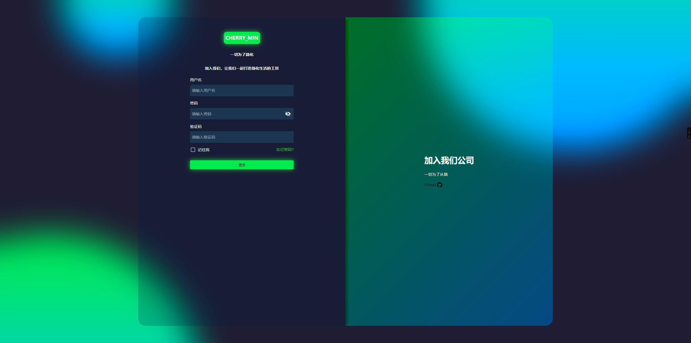
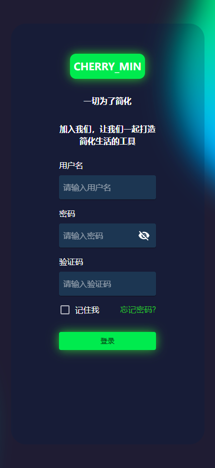

<h1 align='center' style="font-size:5rem"><b>响应式的登录页</b></h1>

   
<h2 align='center'>
您可以使用这个登录页面，进一步定制它
</h2>

   

    <h2>Web模式</h2>
    </img>

    <h2>手机模式</h2>
    </img>

    

    
<h1 align='center'><b>项目使用到的技术</h1>

    

<h1 align='center'><b>前置条件</b></h1>

下载并安装`NodeJS` <a href="https://nodejs.org/">nodeJS.org</a>

    

<h1 align='center'><b>如何运行</b></h1>

第一步,克隆本项目到你的 `IDE`

 
打开 `IDE` 终端,运行 `yarn install` or `npm install`
 

等待依赖安装完毕
执行 `yarn start` or `npm start`
